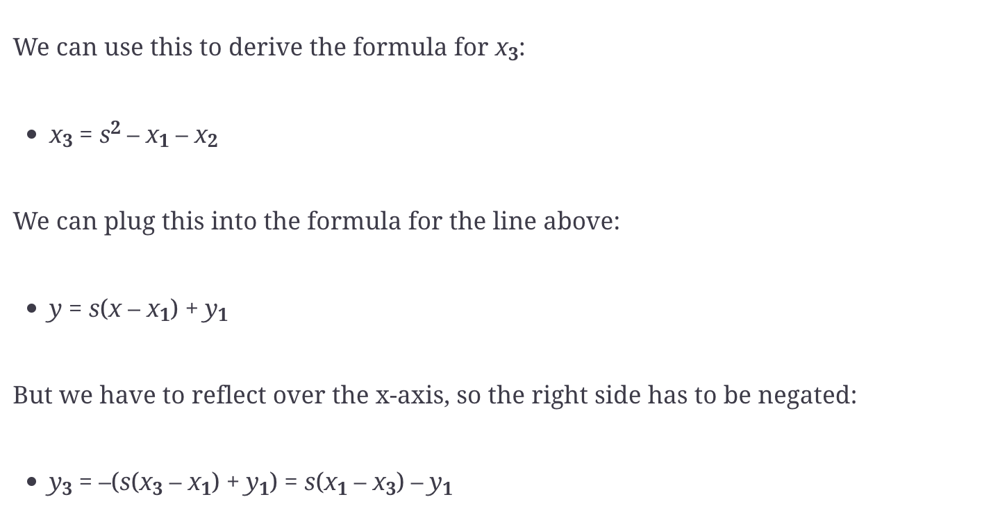

# Finite Fields and Modular Arithmetic

## Finite Field Set

In mathematical notation, the finite field \( F_p \) is defined as:

```
F_p = {0, 1, 2, ..., p–1}

Example:
F_983 = {0, 1, 2, ..., 982}
```

---

## FieldElement Module

In modular arithmetic, computations "wrap around" after reaching a certain number called the modulus. When the modulus
is a prime number (e.g., 7, 13, 29, 97), we refer to it as a **prime modulus**.

A `FieldElement` represents a single number within a finite field and includes:

- `num` — Numeric value of the element.
- `prime` — The modulus defining the finite field.

Example:

```
FieldElement₇(5) represents the number 5 within the finite field modulo 7.
```

---

## Modular Arithmetic

The modulo operation `%` gives the remainder after division:

```
1747 % 241 = 60
```

---

## Finite Field Addition and Subtraction

- **Field Addition:**

```
a +f b = (a + b) % p
```

- **Additive Inverse (Negation):**

```
–f a = (–a) % p
```

_Examples in \(F_{57}\):_

```
44 +f 33 = (44 + 33) % 57 = 20
9 -f 29 = (-20) % 57 = 37
17 +f 42 +f 49 = 51
52 -f 30 -f 38 = 41
```

---

## Finite Field Multiplication and Exponentiation

- **Multiplication:**

Examples in \(F_{19}\):

```
5 ⋅f 3 = (5 ⋅ 3) % 19 = 15
8 ⋅f 17 = (8 ⋅ 17) % 19 = 136 % 19 = 3
```

- **Exponentiation:**

Examples in \(F_{19}\):

```
7³ = 343 % 19 = 1
9¹² % 19 = 7
```

Additional practice examples:

```
95 ⋅ 45 ⋅ 31 % 19 = 23
17 ⋅ 13 ⋅ 19 ⋅ 44 % 19 = 68
127 ⋅ 7749 % 19 = 63
```

---

## Fermat’s Little Theorem

For prime \( p \) and integer \( a \) not divisible by \( p \), Fermat's Little Theorem states:

```
a^(p-1) ≡ 1 mod p

Another variant of form:
n(p–1)%p = 1
```

Thus, any element (except 0) in a finite field \( F_p \), raised to the power \( (p - 1) \), always equals \( 1 \)
modulo \( p \).

## Finite Field Division

b–1 = b(p–2)

- 2/7 = 2⋅7(19 – 2) = 2**717=465261027974414%19 = 3
- 7/5 = 7⋅5(19 – 2) = 7 ** 517=5340576171875%19 = 9
  F31
  3/24 = 3 * 24**(31 - 2) //4
  17^-3 => 17 ** (31 - 3 - 1) % 31 = 29
- 4^–4 ⋅ 11 = 4 ** (31 - 5) % 31 * 11 % 31 => 13

# Elliptic Curve

Specifically, the elliptic curve used in Bitcoin is called secp256k1 and it uses this particular equation:

`y2 = x3 + 7`

# Point addition

So, for any two points P1 = (x1,y1) and P2 = (x2,y2), we get P1 + P2 as follows:


# Point Addition for When x1≠x2

- Calculate the slope

```
P1 = (x1,y1), P2 = (x2,y2), P3 = (x3,y3)
P1 + P2 = P3
s = (y2 – y1)/(x2 – x1)
```

This is the slope, and we can use the slope to calculate x3. Once we know x3, we can calculate y3. P3 can be derived
using this formula:

x3 = s2 – x1 – x2
y3 = s(x1 – x3) – y1
Remember that y3 is the reflection over the x-axis.

For the curve __y__^2^ = __x__^3^ + 5__x__ + 7, what is (2,5) + (–1,–1)?

```
x1, y1 = 2, 5
x2, y2 = -1, -1
s = (y2 - y1) / (x2 - x1)
x3 = s**2 - x1 - x2
y3 = s * (x1 - x3) - y1
```



# Point Addition for When P1 = P2

P1 = –P2 or P1 + P2 = I

```
s = (3x^2 + a)/(2y)
x3 = s^2 – 2x
y3 = s(x1 – x3) – y1

y2 = x3 + 5x + 7, what is (–1,–1) + (–1,–1)

s = (3 * (-1)**2 + 5)/-2= -4
x3 = -4^2 + 2 = 18
y3 = -4*(-1 - 18) - (-1) = 77
```

# Scalar Multiplication for Elliptic Curves

Similarly, because we have associativity, we can actually add the point again:

2 ⋅ (170,142) + (170,142) = 3 ⋅ (170, 142)
We can do this as many times as we want. This is what we call scalar multiplication. That is, we have a scalar number in
front of the point.

{ G, 2G, 3G, 4G, ... nG } where nG = 0

For the curve y^2 = x^3 + 7 over F223,
find the order of the group generated by (15,86).

- The order of a point
  𝑃
  P on an elliptic curve is the smallest positive integer
  𝑛
  n such that
  𝑛
  𝑃
  =
  ∞
  nP=∞

# Defining the Curve for Bitcoin

An elliptic curve for public key cryptography is defined with the following parameters:

We specify the a and b of the curve y2 = x3 + ax + b.

We specify the prime of the finite field, p.

We specify the x and y coordinates of the generator point G.

We specify the order of the group generated by G, n.

The parameters for secp256k1 are these:

a = 0, b = 7, making the equation y2 = x3 + 7

p = 2256 – 232 – 977

Gx =
0x79be667ef9dcbbac55a06295ce870b07029bfcdb2dce28d959f2815b16f81798

Gy =
0x483ada7726a3c4655da4fbfc0e1108a8fd17b448a68554199c47d08ffb10d4b8

n = 0xfffffffffffffffffffffffffffffffebaaedce6af48a03bbfd25e8cd0364141

# Public Key Cryptography

Generally, we call e the private key and P the public key. Note here that the private key is a single 256-bit number and
the public key is a coordinate (x,y), where x and y are each 256-bit numbers.

e = (k–u)/v

To wit, here are the steps:

- We are given (r,s) as the signature, z as the hash of the thing being signed, and P as the public key (or public
  point)
  of the signer.

- We calculate u = z/s, v = r/s.

- We calculate uG + vP = R.

- If R’s x coordinate equals r, the signature is valid.

# Programming Message Signing
