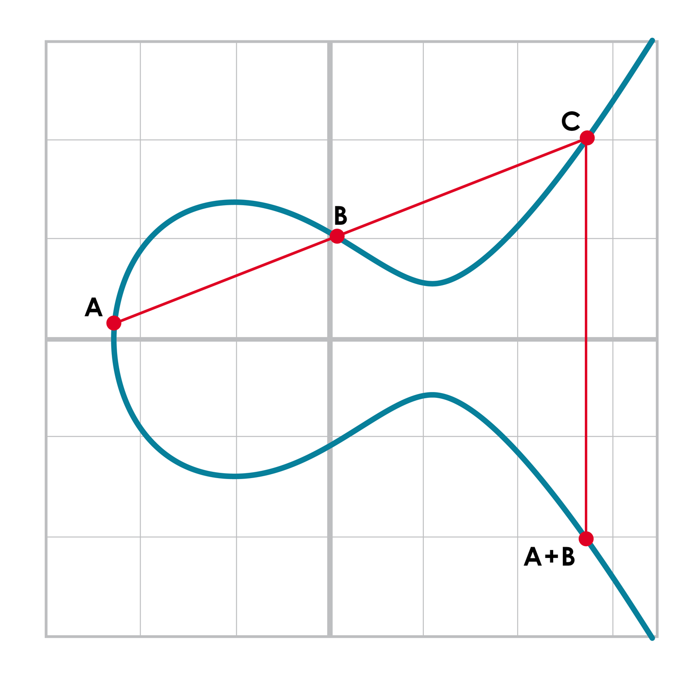

# Finite Fields and Modular Arithmetic

## Finite Field Set

In mathematical notation, the finite field \( F_p \) is defined as:

```
F_p = {0, 1, 2, ..., p–1}

Example:
F_983 = {0, 1, 2, ..., 982}
```

---

## FieldElement Module

In modular arithmetic, computations "wrap around" after reaching a certain number called the modulus. When the modulus
is a prime number (e.g., 7, 13, 29, 97), we refer to it as a **prime modulus**.

A `FieldElement` represents a single number within a finite field and includes:

- `num` — Numeric value of the element.
- `prime` — The modulus defining the finite field.

Example:

```
FieldElement₇(5) represents the number 5 within the finite field modulo 7.
```

---

## Modular Arithmetic

The modulo operation `%` gives the remainder after division:

```
1747 % 241 = 60
```

---

## Finite Field Addition and Subtraction

- **Field Addition:**

```
a +f b = (a + b) % p
```

- **Additive Inverse (Negation):**

```
–f a = (–a) % p
```

_Examples in \(F_{57}\):_

```
44 +f 33 = (44 + 33) % 57 = 20
9 -f 29 = (-20) % 57 = 37
17 +f 42 +f 49 = 51
52 -f 30 -f 38 = 41
```

---

## Finite Field Multiplication and Exponentiation

- **Multiplication:**

Examples in \(F_{19}\):

```
5 ⋅f 3 = (5 ⋅ 3) % 19 = 15
8 ⋅f 17 = (8 ⋅ 17) % 19 = 136 % 19 = 3
```

- **Exponentiation:**

Examples in \(F_{19}\):

```
7³ = 343 % 19 = 1
9¹² % 19 = 7
```

Additional practice examples:

```
95 ⋅ 45 ⋅ 31 % 19 = 23
17 ⋅ 13 ⋅ 19 ⋅ 44 % 19 = 68
127 ⋅ 7749 % 19 = 63
```

---

## Fermat’s Little Theorem

For prime \( p \) and integer \( a \) not divisible by \( p \), Fermat's Little Theorem states:

```
a^(p-1) ≡ 1 mod p

Another variant of form:
n(p–1)%p = 1
```

Thus, any element (except 0) in a finite field \( F_p \), raised to the power \( (p - 1) \), always equals \( 1 \)
modulo \( p \).

## Finite Field Division

b–1 = b(p–2)

- 2/7 = 2⋅7(19 – 2) = 2**717=465261027974414%19 = 3
- 7/5 = 7⋅5(19 – 2) = 7 ** 517=5340576171875%19 = 9
  F31
  3/24 = 3 * 24**(31 - 2) //4
  17^-3 => 17 ** (31 - 3 - 1) % 31 = 29
- 4^–4 ⋅ 11 = 4 ** (31 - 5) % 31 * 11 % 31 => 13

# Elliptic Curve

Specifically, the elliptic curve used in Bitcoin is called secp256k1 and it uses this particular equation:

`y2 = x3 + 7`

# Point addition

So, for any two points P1 = (x1,y1) and P2 = (x2,y2), we get P1 + P2 as follows:

